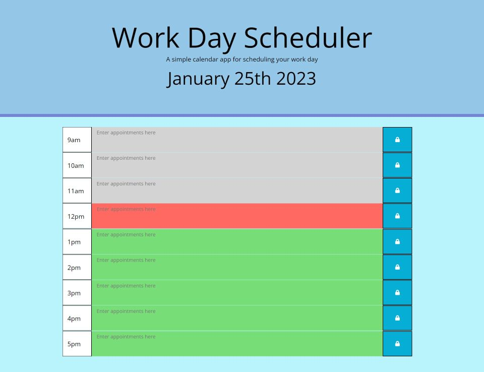

# Workday-Scheduler

Unlike previous challenges, I used Google a lot to learn the techniques used in this particular challenge. It was very disorienting going from learning JavaScript to using jQuery. Mainly because it doesn't have syntax I would regard as being similar to other programming languages that I am familiar with. The best illustration of this is that while trying to get the date and time working using jQuery and Momentjs, I just could not get the date to show on the page. I rewrote the JavaScript and HTML, and I'm not even sure it was particularly different, but it then started working. I was very careful to check every time I made changes that the date display was still working - and on a few occasions it wasn't. I have put that down to my inexperience rather than the code being temperamental. Happily, it was just one week being spent on jQuery and I hope to avoid it as much as possible in the future.

The header was straightforward enough (apart fron displaying the date), and I was tempted to use Bootstrap 5 and just make my own header rather than using the jumbotron, but I didn't know if I would be penalized for that, so I stuck with Bootstrap 4. The next part of the HTML was awkward, because I have a nagging suspicion that there must be a better way to use more or less the same piece of code over and over - possibly by using a for loop in the JavaScript. I shall have a good look at this subject when I have some spare time.

Happily there is plenty of information about local storage on MDN, which was really the main part of this challenge. Using local storage is something I very much enjoy doing, and will be trying to think how I could incorporate it into an app I could put on my portfolio. The "present, "past" and "future" system was very similar to the changing of questions and answers in last week's challenge, so I didn't have too much trouble with that. And, as I say, setting and getting local storage information is practically a joyful experience.

I made some slight changes to the CSS just to make the page look more aesthetically pleasing to myself. I hope that's not something I will be marked down for. 

<https://bertiemoogle.github.io/Workday-Scheduler/>